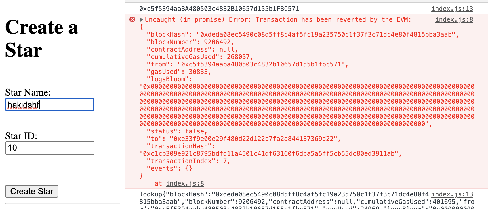

# Star Notary
### ERC-721 Token name = "Star Token";
### ERC-721 Token symbol = "STC";
### version Truffle and OpenZeppelin used
```
 "dependencies": {
    "openzeppelin-solidity": "^2.1.2",
    "truffle-hdwallet-provider": "^1.0.0-web3one.5"
  },
```

## Note:
I used `ropsten network` instead `rinkeby`, because my account is still 0 for rinkeby. <br />
any attempts to request for ETH in rinkeby network are failed. <br />


## How to Run
1. create file `.secret` and fill in your mnemonic seed words
2. run `truffle develop`
3. run `truffle migrate --reset --network ropsten` <br />
<i>I use ropsten network because I cannot get ETH in my rinkeby </i>account
3. go to client `cd app`
4. `npm install` and `npm run dev`
5. go to `localhost:8080`
6. block with `star ID = 10` and `starID = 20` are already created, attempt to recreate this id will be rejected by EVM



